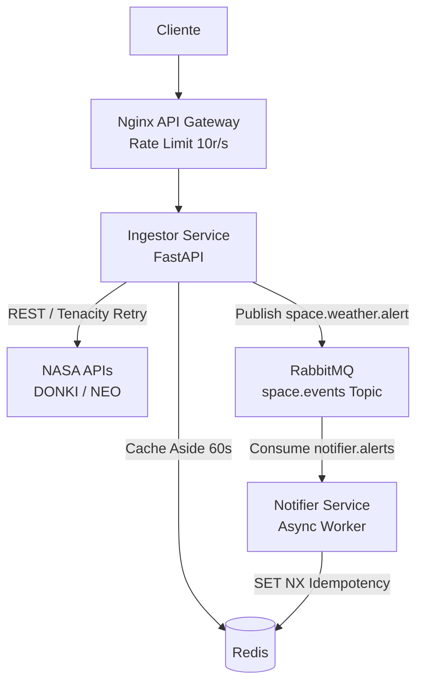

## Arquitetura e Diagrama



## Como Executar

### Pré-requisitos
- Docker
- Docker Compose

### Subindo a Stack
Para inicializar os bancos (Redis, RabbitMQ), o Nginx e os dois serviços, execute na raiz do projeto:

```bash
docker-compose up -d --build
```
### Consumindo a API
A API estará exposta através do Nginx na porta **8080**:

- **Clima Espacial Atual (com cache):**
  ```bash
  curl -i http://localhost:8080/api/space-weather/current
  ```
- **Disparar Ingestão Manual (valida e publica no RabbitMQ):**
  ```bash
  curl -i -X POST http://localhost:8080/api/space-weather/ingest
  ```
- **Feed de Asteroides NEO (Pass-through direto):**
  ```bash
  curl -i "http://localhost:8080/api/neo/feed?start_date=2024-01-01&end_date=2024-01-02"
  ```

## Justificativa Técnica: TTL de 60 Segundos
A implementação do cache-aside com um TTL de 60 segundos na rota do DONKI é essencial para a resiliência e estabilidade do sistema de ingestão. Como as informações astronômicas de tempestades não sofrem mudanças bruscas repentinas, um cache de 1 minuto protege nosso IP de exceder os rate limits das APIs públicas da NASA. Ao mesmo tempo, caso ocorra um pico de tráfego, o sistema será capaz de responder instantaneamente a partir da memória via Redis. Isso diminui radicalmente a latência, enquanto mantém os dados operacionais satisfatoriamente "frescos" para disparos de alertas.

## Testes Automatizados e de Carga

### Testes Unitários
Foram criados testes em `pytest` abordando a Regra de Negócio 1 (fronteiras do índice Kp) e Regra de Negócio 3 (garantia de idempotência via mocks).

Para rodá-los localmente, configure o ambiente Python com as dependências dos serviços e as ferramentas de teste.

```bash
# 1. Crie e ative o ambiente virtual
python -m venv venv
.\venv\Scripts\activate

# 2. Instale as dependências da aplicação principal
pip install -r src/ingestor-service/requirements.txt
pip install -r src/notifier-service/requirements.txt

# 3. Instale as ferramentas de teste
pip install -r tests/requirements.txt

# 4. Execute os testes na raiz do projeto
pytest tests/ -v
```

### Teste de Carga (K6)
Para garantir que a API aguenta tráfego intenso e responde rapidamente graças ao cache:
```bash
k6 run k6/smoke.js
```
